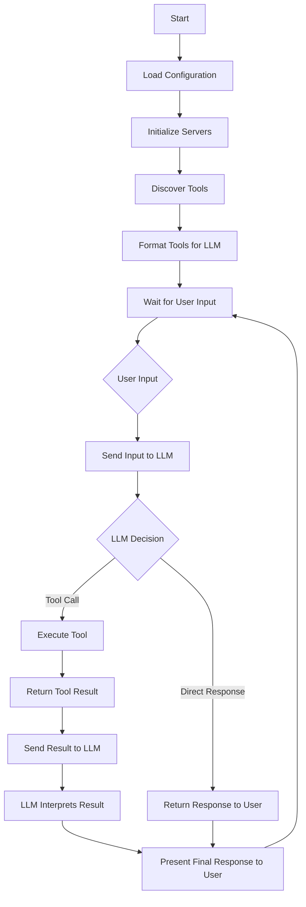

# MyLLM - MCP Chatbot Package

MyLLM is a Python package that demonstrates how to integrate the Model Context Protocol (MCP) into a simple CLI chatbot. The implementation showcases MCP's flexibility by supporting multiple tools through MCP servers and is compatible with any LLM provider that follows OpenAI API standards.

If you find this project helpful, don't forget to ⭐ star the [repository](https://github.com/alpha-lab/myllm) or buy me a ☕ [coffee](https://ko-fi.com/3choff).

## Key Features

- **LLM Provider Flexibility**: Works with any LLM that follows OpenAI API standards (tested with Llama 3.2 90b on Groq and GPT-4o mini on GitHub Marketplace).
- **Dynamic Tool Integration**: Tools are declared in the system prompt, ensuring maximum compatibility across different LLMs.
- **Server Configuration**: Supports multiple MCP servers through a simple JSON configuration file like the Claude Desktop App.
- **Easy Installation**: Install as a Python package with `pip install -e .` and use via command line.

## Requirements

- Python 3.8+
- `python-dotenv`
- `requests`
- `fastmcp`
- `uvicorn`

## Installation

### Option 1: Install from Source (Development)

1. **Clone the repository:**

   ```bash
   git clone https://github.com/alpha-lab/myllm.git
   cd myllm
   ```

2. **Install the package in development mode:**

   ```bash
   pip install -e .
   ```

## Configuration

### 1. Set up environment variables

Create a `.env` file in your working directory and add your API credentials:

```plaintext
LLM_API_KEY=your_api_key_here
LLM_URL=https://your-llm-provider.com/v1/chat/completions
LLM_MODEL=your-model-name
```

### 2. Configure MCP servers

The `servers_config.json` follows the same structure as Claude Desktop, allowing for easy integration of multiple servers. 

**Example configuration (sse):**

```json
{
  "mcpServers": {
    "mcp1": {
      "url": "http://xx.xx.xx.xx:1234/sse"
    },
    "mcp2": {
      "url": "http://xx.xx.xx.xx:1234/sse"
    }
  }
}
```


## Usage

### Command Line Interface

After installation, you can use the `myllm` command from anywhere:

```bash
myllm
```

### Python API

You can also use MyLLM programmatically in your Python code:

```python
import asyncio
from myllm import Configuration, Server, LLMClient, ChatSession

async def main():
    # Load configuration
    config = Configuration()
    server_config = config.load_config('servers_config.json')
    
    # Initialize servers
    servers = [Server(name, srv_config) for name, srv_config in server_config['mcpServers'].items()]
    
    # Initialize LLM client
    llm_client = LLMClient(config.llm_api_key, config.llm_url, config.llm_model)
    
    # Create chat session
    chat_session = ChatSession(servers, llm_client)
    
    # Start the session
    await chat_session.start()

# Run the async function
asyncio.run(main())
```

### Interactive Session

1. **Start the chatbot:**

   ```bash
   myllm
   ```

2. **Interact with the assistant:**
   
   The assistant will automatically detect available tools and can respond to queries based on the tools provided by the configured servers.

3. **Exit the session:**

   Type `quit` or `exit` to end the session.

## Architecture

- **Tool Discovery**: Tools are automatically discovered from configured servers.
- **System Prompt**: Tools are dynamically included in the system prompt, allowing the LLM to understand available capabilities.
- **Server Integration**: Supports any MCP-compatible server, tested with various server implementations including Uvicorn and Node.js.

### Class Structure

- **Configuration**: Manages environment variables and server configurations
- **Server**: Handles MCP server initialization, tool discovery, and execution
- **Tool**: Represents individual tools with their properties and formatting
- **LLMClient**: Manages communication with the LLM provider
- **ChatSession**: Orchestrates the interaction between user, LLM, and tools

### Logic Flow



1. **Initialization**:
   - Configuration loads environment variables and server settings
   - Servers are initialized with their respective tools
   - Tools are discovered and formatted for LLM understanding

2. **Runtime Flow**:
   - User input is received
   - Input is sent to LLM with context of available tools
   - LLM response is parsed:
     - If it's a tool call → execute tool and return result
     - If it's a direct response → return to user
   - Tool results are sent back to LLM for interpretation
   - Final response is presented to user

3. **Tool Integration**:
   - Tools are dynamically discovered from MCP servers
   - Tool descriptions are automatically included in system prompt
   - Tool execution is handled through standardized MCP protocol


## License

This project is licensed under the [MIT License](https://github.com/0xrushi/myllm/blob/main/LICENSE).